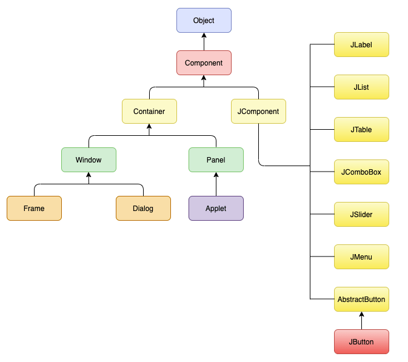

# AWT and Swing in Java
AWT and Swing are used to develop window-based (Desktop) applications in Java.

### AWT
Awt is an abstract window toolkit that provides various component classes like Label, Button, TextField, etc., to show window components on the screen. All these classes are part of the Java.awt package.

### Swing
Swing is the part of JFC (Java Foundation Classes) built on the top of AWT and written entirely in Java. The javax.swing API provides all the component classes like JButton, JTextField, JCheckbox, JMenu, etc.

The components of Swing are platform-independent, i.e., swing doesn't depend on the operating system to show the components. Also, the Swing's components are lightweight. 

## Java Swing Hierarchy
The components follow a hierarchy based on that components are stacked or place on top of each other.

